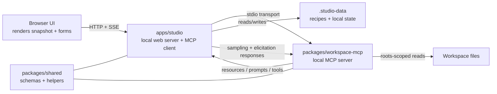

# Architecture Overview

Back to [Diagrams README](./README.md)

This diagram shows the major runtime boundaries in the playground.

## What To Notice

- The browser never speaks MCP directly.
- The studio process is both a web server and an MCP client.
- The MCP server can ask the studio for roots, sampling, and elicitation.
- Shared schemas keep the browser snapshot and MCP-facing data structures aligned.
