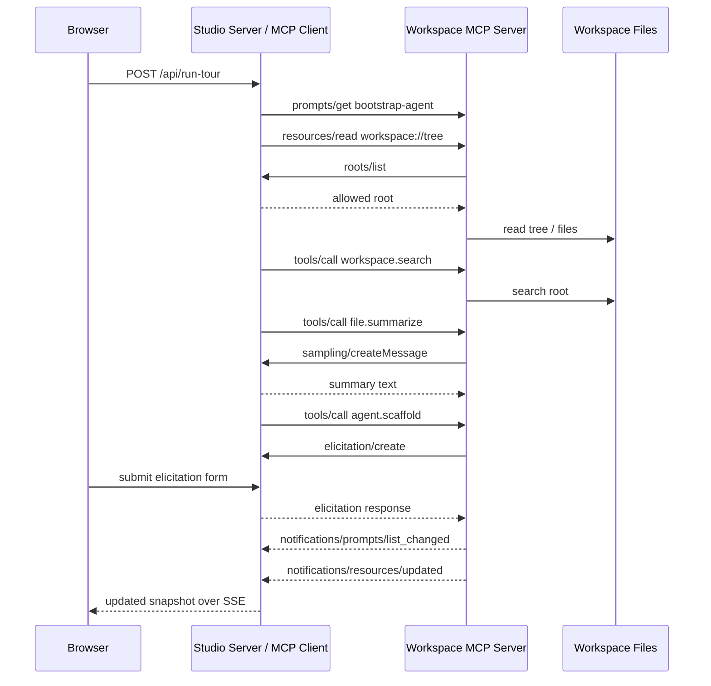

# Protocol Tour Sequence

Back to [Diagrams README](./README.md)

This is the happy-path teaching flow that the browser's `Run protocol tour` button drives.

## What To Notice

- The client owns the root boundary.
- Sampling and elicitation both reverse the normal request direction.
- The tour intentionally touches every major primitive so the trace is educational, not just functional.
