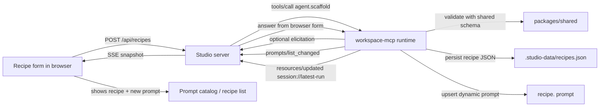

# Recipe Publication Flow

Back to [Diagrams README](./README.md)

This diagram focuses on the most "self-serve agent" part of the playground.

## What To Notice

- A recipe is both persisted data and a new MCP prompt.
- `prompts/list_changed` is the mechanism that tells the studio to refresh discovery state.
- The latest-run resource lets the UI reflect tool activity without inventing a separate custom event channel.
